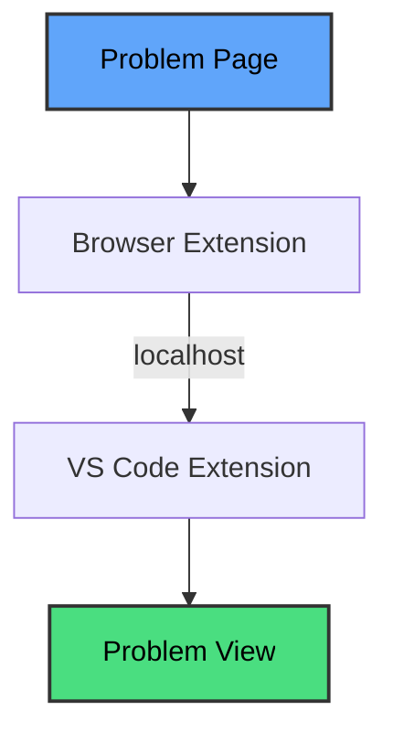
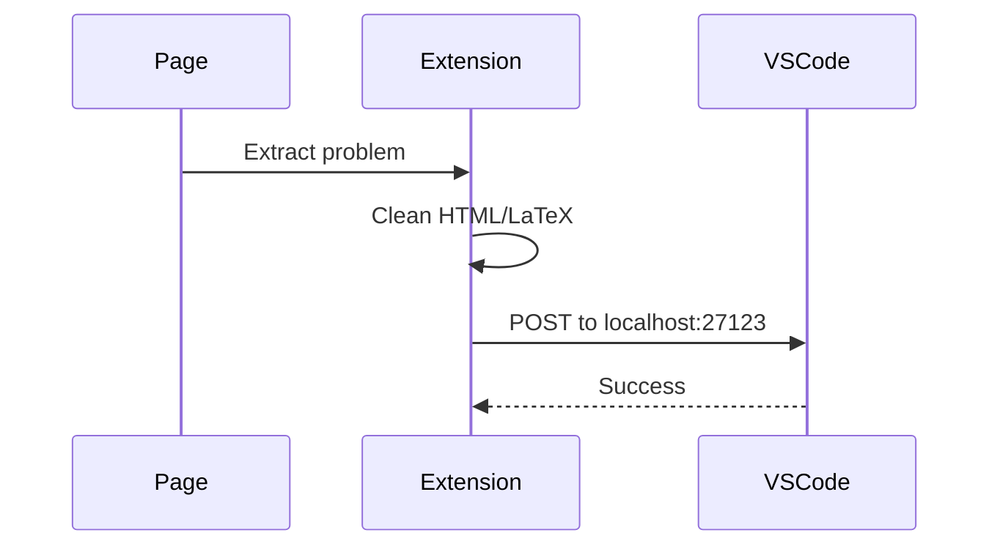

# AlgoBridge

Bring competitive programming problems directly into VS Code. No more switching tabs to read problem statements.

## Why?

Context switching between browser and editor is annoying and slow. You lose focus, miss constraints, and waste time scrolling back and forth.

Here's the thing: on platforms where the problem statement stays visible while you code, the workflow actually feels faster and more reliable. You can reference constraints instantly, catch edge cases as you write, and never lose your train of thought.

AlgoBridge brings that same experience to every competitive programming platform by keeping the problem statement right inside your editor.

## Features

- Click once in browser, problem appears in VS Code
- Clean formatting with proper math rendering
- Everything runs locally on your machine
- Easy to add new platforms

## Components

AlgoBridge has two parts that work together:

**Browser Extension** - Extracts problem data from the page, cleans up HTML and math expressions, then sends it to your editor.

**VS Code Extension** - Runs a local HTTP server that receives and displays problems inside VS Code.

Both are required for AlgoBridge to work.

## How it works



The browser extension grabs the problem from the page, cleans it up, and sends it to VS Code over localhost. That's it.

### Under the hood

**Browser side:**


**VS Code side:**


No servers, no cloud, no tracking. Just your browser talking to your editor.

## Design Goals

AlgoBridge is built around four principles:

- **Minimal and distraction-free** - Clean interface that stays out of your way
- **Editor-first workflow** - Keep your focus in VS Code where you're most productive
- **No platform lock-in** - Works across multiple competitive programming sites
- **Easy extensibility** - Simple architecture makes adding new platforms straightforward

These goals guide every decision about features and implementation.

## Installation

**VS Code Extension:**
1. Open VS Code
2. Search "AlgoBridge" in extensions
3. Install and you're done (starts automatically)

**Browser Extension:**
1. Install from Chrome Web Store or Firefox Add-ons
2. Pin it to your toolbar

Both extensions need to be installed to work together.

## Supported Platforms

Right now:
- **Codeforces** ✓

Coming soon:
- LeetCode
- AtCoder
- More platforms

Adding new platforms is straightforward if you want to contribute.

## Usage

1. Open a problem on Codeforces
2. Click the AlgoBridge extension
3. Problem shows up in VS Code instantly
4. Start coding

## Project Structure

```
algobridge/
├── vscode-extension/      # VS Code extension
├── chrome-extension/     # Browser extension  
└── README.md
```

<!-- ## Contributing

Want to add a platform or fix something? Great!

1. Fork the repo
2. Make your changes
3. Send a pull request

Check out `chrome-extension/src/platforms/codeforces.ts` to see how platform support works. -->

## Privacy

- Everything runs on your computer
- No data leaves your machine
- No analytics or tracking
- Open source

## Roadmap

**Near term:**
- LeetCode and AtCoder support
- Auto-generate solution files
- Code templates

**Later:**
- Better math rendering
- Submit solutions from VS Code
- Test case management

## License

MIT

## Questions?

Open an issue on GitHub or start a discussion.

---

Built for competitive programmers who want to stay in their editor.
