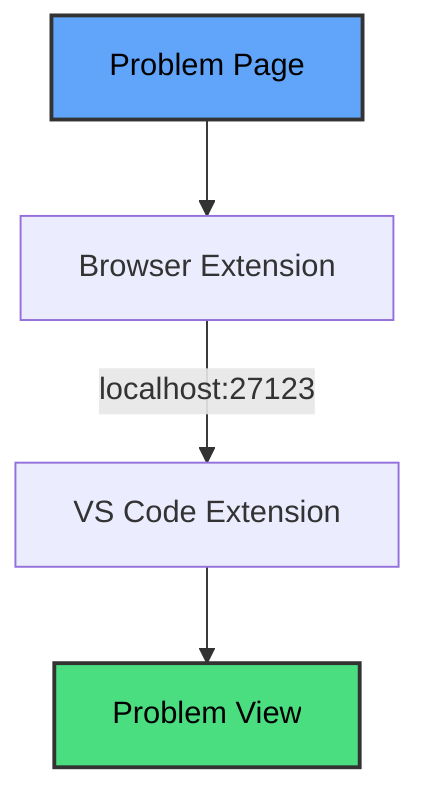
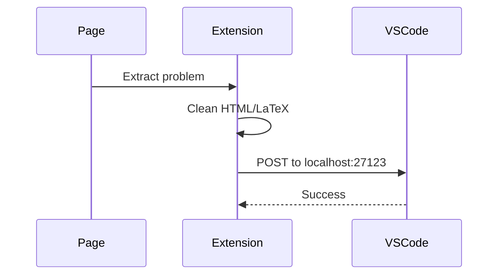
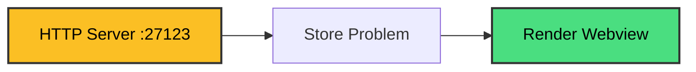

# AlgoBridge

Bring competitive programming problems directly into VS Code. No more switching tabs to read problem statements.

## Why?

Context switching between browser and editor is annoying and slow. You lose focus, miss constraints, and waste time scrolling back and forth.

Here's the thing: on platforms where the problem statement stays visible while you code, the workflow actually feels faster and more reliable. You can reference constraints instantly, catch edge cases as you write, and never lose your train of thought.

AlgoBridge brings that same experience to every competitive programming platform by keeping the problem statement right inside your editor.

## Features

- **One-Click Import**: Extract problems from the browser instantly using the extension toolbar.
- **Automated File Management**: Detects existing solution files or creates a new `.cpp` file with a pre-configured template.
- **Proper Math Rendering**: High-fidelity LaTeX rendering powered by KaTeX.
- **Intelligent Sidebar Sync**: Automatically switches the displayed problem when you change active editor tabs.
- **Persistent Storage**: Problem data is saved locally so statements remain available after restarting VS Code.

## How it works



The browser extension grabs the problem from the page, cleans the HTML/LaTeX, and sends it to the VS Code extension listening on port **27123**.

### Under the hood

**Browser side:**



**VS Code side:**



No servers, no cloud, no tracking. Just your browser talking to your editor over a local port.

## Design Goals

AlgoBridge is built around four principles:

- **Minimal and distraction-free** - Clean interface that stays out of your way.
- **Editor-first workflow** - Keep your focus in VS Code where you're most productive.
- **No platform lock-in** - Architecture designed to work across multiple competitive programming sites.
- **Easy extensibility** - Simple DOM extraction makes adding new platforms straightforward.

## Installation

**VS Code Extension:**

1. Open VS Code.
2. Install the AlgoBridge extension (starts automatically upon activation).

**Browser Extension:**

1. Load the `chrome-extension` folder as an unpacked extension.
2. Pin it to your toolbar.

## Supported Platforms

- **Codeforces** ✓
- **Upcoming**: LeetCode, AtCoder.

## Usage

1. Open a problem on Codeforces.
2. Click the AlgoBridge extension.
3. The problem appears in VS Code instantly, and a solution file is found or created.

## Configuration

- **Port**: 27123 (Local HTTP).
- **File Naming**: Converts titles to searchable IDs (e.g., `A_Next_Round.cpp`).
- **Templates**: Newly created `.cpp` files include a standard competitive programming boilerplate.

## Project Structure

```
algobridge/
├── vscode-extension/
├── chrome-extension/
├── firefox-extension/
└── README.md

```

## Privacy

- Everything runs on your computer.
- No data leaves your machine.
- No analytics or tracking.
- Open source and local-only.

## License

MIT

---

Built for competitive programmers who want to stay in their editor.
