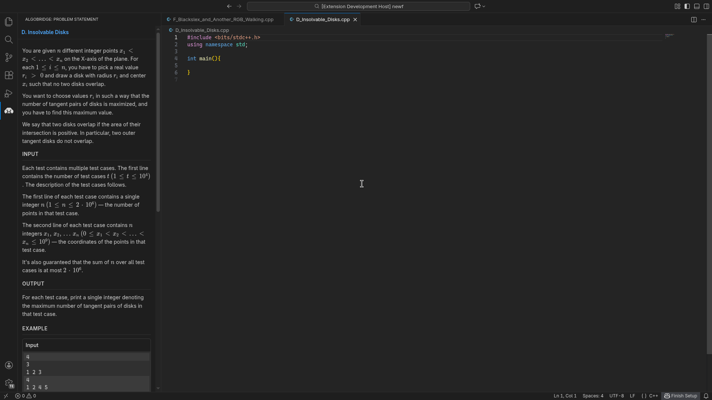
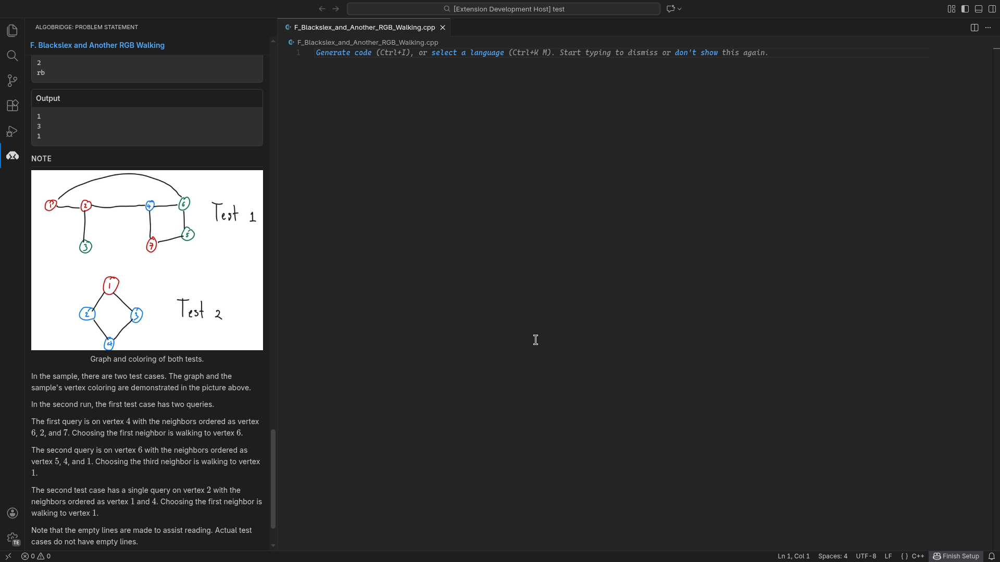
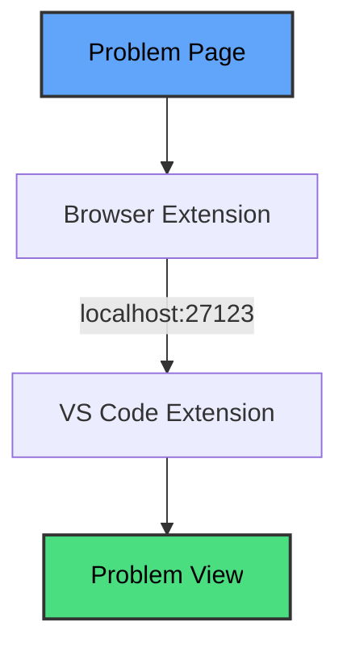

# AlgoBridge for VS Code

Bring competitive programming problems directly into your editor. No more switching tabs to read statements or copy constraints.

## Why?

Context switching between browser and editor is annoying and slow. You lose focus, miss constraints, and waste time scrolling back and forth.

On platforms where the problem statement stays visible while you code, the workflow is faster and more reliable. AlgoBridge brings that experience to VS Code, allowing you to reference constraints instantly and catch edge cases as you write.

## Extension in Action

*Click the browser extension and the problem appears instantly in your sidebar.*

*Reference constraints and sample tests while you write your solution.*

*AlgoBridge automatically detects your files or creates new ones with your custom template.*

## Features

- **Instant Visibility**: One click in your browser brings the problem statement directly into a sidebar view.
- **Clean Math Rendering**: Uses KaTeX to render LaTeX expressions with high-performance formatting.
- **Auto-Syncing**: Automatically updates the problem view when you switch between active editor tabs.
- **Workspace Integration**: Offers to automatically create solution files with a C++ template when a new problem is received.
- **Privacy First**: Everything runs locally. Your browser talks directly to your editor over port **27123**.

## How it works

## Requirements

To use this extension, you must also install the **AlgoBridge Browser Extension** (available for Chrome and Firefox) to extract problem data from web pages.

## Installation

1. Install this extension from the VS Code Marketplace.
2. Open a folder or workspace in VS Code.
3. The extension will start its local server on port `27123` automatically.

## Supported Platforms

* **Codeforces** ✓
* More platforms (LeetCode, AtCoder) coming soon.

## Privacy

* No data leaves your machine.
* No analytics or tracking.
* Communication happens strictly over your local network.

---

Built for competitive programmers who want to stay in their editor.